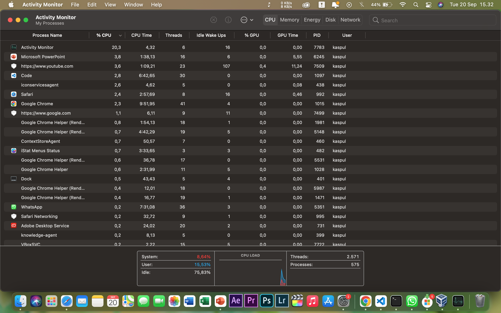
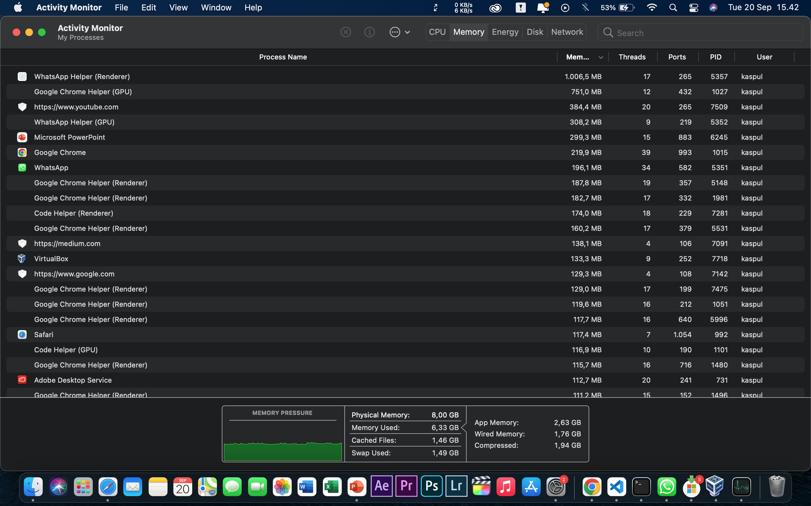
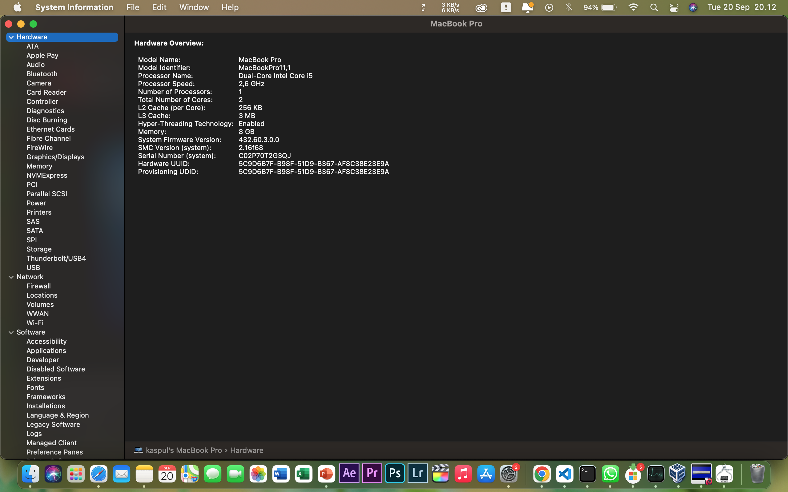
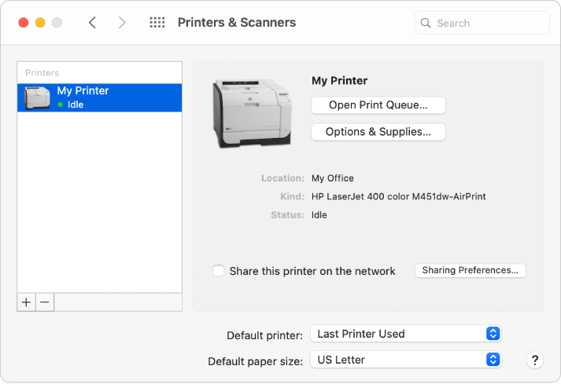
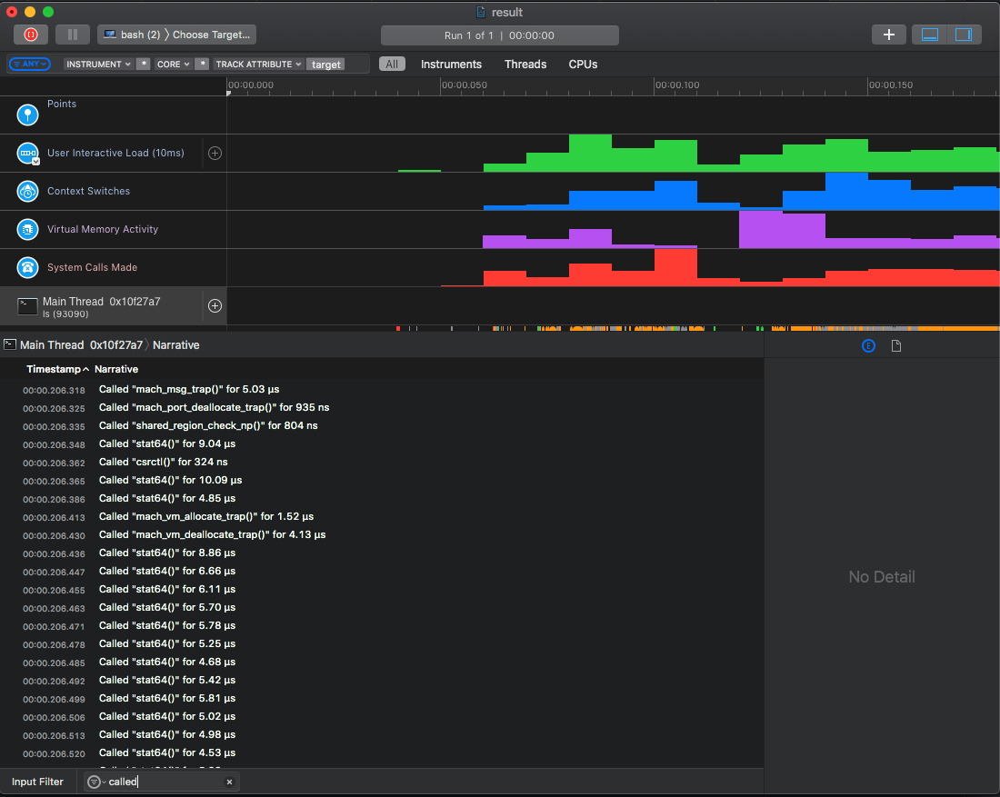

# SISTEM OPERASI KOMPUTER

## KOMPONEN SISTEM OPERASI

### 1.Manajemen Proses 

 Proses adalah sebuah program yang sedang dieksekusi. Sebuah proses membutuhkan beberapa sumber daya untuk menyelesaikan tugasnya. sumber daya tersebut dikelola oleh Sistem Operasi digunakan di penggunaan CPU, memori, berkas-berkas, dan perangkat-perangkat M/K

 Sistem operasi bertanggung-jawab atas aktivitas-aktivitas yang berkaitan dengan manajemen proses seperti: 
Membuat dan menghapus proses pengguna dan sistem proses. 
1. Menunda atau melanjutkan proses. 
2. Menyediakan mekanisme untuk sinkronisasi proses. 
3. Menyediakan mekanisme untuk komunikasi proses. 
4. Menyediakan mekanisme untuk penanganan deadlock.



Gambar diatas berupa task manager diambil dari laptop saya. ada beberapa sumber daya yang sedang dilakukan.  Alokasi sumber daya tersebut dikelola oleh Sistem Operasi Umpamanya penggunaan CPU, memori, berkas-berkas, dan perangkat-perangkat M/K dan lainnya.

### 2. Manajemen Memori Utama

Berkas adalah kumpulan informasi yang berhubungan, sesuai dengan tujuan pembuat berkas tersebut. 
Umumnya berkas merepresentasikan program dan data. Berkas dapatmempunyai struktur yang bersifat hirarkis (direktori, volume, dll.).

Sistem operasi bertanggung-jawab dalam aktivitas yang berhubungan dengan manajemen berkas: 
1. Pembuatan dan penghapusan berkas. 
2. Pembuatan dan penghapusan direktori. 
3. Mendukung manipulasi berkas dan direktori. 
4. Memetakan berkas ke secondary-storage.
5. Mem-back-up berkas ke media penyimpanan yang permanen (non-volatile). 



Gambar diatas berupa task manager diambil dari laptop saya. terdapat beberapa informasi diatas mencakup penggunaan memori dan lainnya.

### 3. Manajaemen Sistem I/O

Sistem ini sering disebut dengan device manager. 
Menyediakan device driver yang umum sehingga operasi Masukan/Keluaran dapat seragam (membuka, membaca, menulis, menutup). 

Komponen Sistem Operasi untuk sistem Masukan/Keluaran: 
1. Penyangga: menampung sementara data dari/ke perangkat Masukan/Keluaran. 
2. Spooling: melakukan penjadwalan pemakaian Masukan/Keluaran sistem supaya lebih efisien (antrian dsb.). 
3. Menyediakan driver: untuk dapat melakukan operasi rinci untuk perangkat keras  Masukan/Keluaran tertentu



gambar diatas berupa device manager yang diambil dari laptop saya. terdapat beberapa perangkat i/o yang saling berhubungan.

<br>

## Layanan Sistem Operasi 

### 1. Manipulasi Sistem Berkas

Program harus membaca dan menulis berkas, dan kadang kala juga harus membuat dan menghapus berkas, hal ini dapat dilakukan di finder.

Dari finder kita dapat menggunakan berkas yang terdapat di laptop. contoh pembuatan sebuah folder.

Berikut dibawah ini cara memanipulasi berkas dengan menggunakan finder untuk membuat folder baru:

1. klik dua kali lalu tekan new folder.


2. lalu beri nama dan folder berhasil dibuat.


## 2. Deteksi Error dan Solusi Pada Kesalahan

Sistem operasi harus selalu waspada terhadap kemungkinan error. Error dapat terjadi di CPU dan memori perangkat keras, Masukan/Keluaran, dan di dalam program yang dijalankan pengguna. Untuk setiap jenis error sistem operasi harus bisa mengambil langkah yang tepat untuk mempertahankan jalannya proses komputasi.

Bila terdapat sebuah masalah pada sistem komputer maka sistem operasi akan memberikan tanggapan atau solusi terhadap kesalahan dan apa dampaknya jalan program.


gambar diatas diambil dari laptop saya. Troubleshooter akan mendeteksi sebuah masalah dan akan memberi solusi untuk memperbaikinya.

### 3. Operasi I/O (Masukan/Keluaran)

 adalah suatu komponen dalam sistem komputer yang bertanggung jawab atas pengontrolan sebuah perangkat luar atau lebih dan bertanggung jawab pula dalam pertukaran data ( menerima dan mengirimkan data ) antara perangkat luar tersebut dengan memori utama ataupun dengan register – register CPU. 

Contohnya adalah Printer:



## System Call

Biasanya tersedia sebagai instruksi bahasa assembly. Beberapa sistem mengizinkan system calls dibuat langsung dari program bahasa tingkat tinggi. Beberapa bahasa pemrograman (contoh: C, C++) telah didefenisikan untuk menggantikan bahasa assembly untuk sistem pemrograman. 

System calls yang berhubungan dengan kontrol proses antara lain ketika penghentian pengeksekusian program. Baik secara normal (end) maupun tidak normal (abort). 
Selama proses dieksekusi kadang kala diperlukan untuk me-load atau mengeksekusi program lain, disini diperlukan lagi suatu system calls. Juga ketika membuat suatu proses baru dan menghentikan sebuah proses. Ada juga system calls yang dipanggil ketika kita ingin meminta dan merubah atribut dari suatu proses. 
MS-DOS adalah contoh dari sistem single-tasking. MS-DOS menggunakan metoda yang sederhana dalam menjalankan program aan tidak menciptakan proses baru. Program di-load ke dalam memori, kemudian program dijalankan. Berkeley Unix adalah contoh dari sistem multi-tasking. Command Interpereter masih tetap bisa dijalankan ketika program lain dieksekusi. 

Contoh penggunaan commend line:



Dengan  command

```
result.trace
```

lalu akan menjalankan operasi pengecekan terhadap penyimpanan sistem operasi untuk mendeteksi masalah pada sistem.
